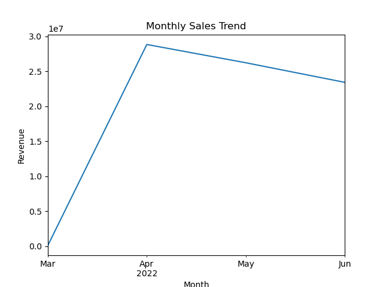
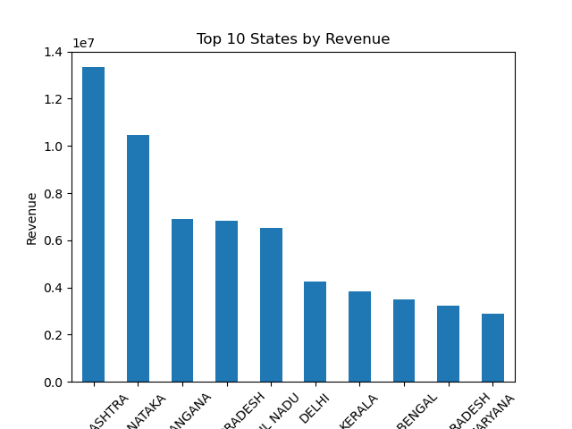
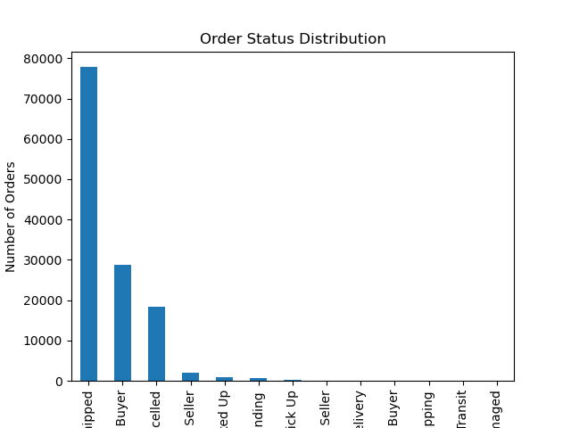

# Amazon Sales Data Analysis

## Project Overview
This project analyzes Amazon sales data to identify revenue trends, regional performance, and order status distribution.

## Tools Used
- Python
- Pandas
- Matplotlib
- Jupyter Notebook

## Dataset
The dataset contains Amazon order records including product category, sales revenue, shipping location, and order status.
Note: Original dataset is ~68MB. For demonstration purposes, this repository uses a 5% random sample of the data.

## Key Questions
- Which product categories generate the most revenue?
- Which regions produce the highest sales?
- What are the monthly sales trends?
- What is the cancellation rate?

## Key Insights
- The majority of revenue comes from the **Set** category.
- **Maharashtra** generates the highest revenue among states.
- Sales peaked in **March 2022**.
- A noticeable percentage of orders were cancelled.
- Orders are most frequently placed on **Sundays**.

## Visualizations

### Monthly Revenue Trend

### Top States by Revenue

### Order Status Distribution

