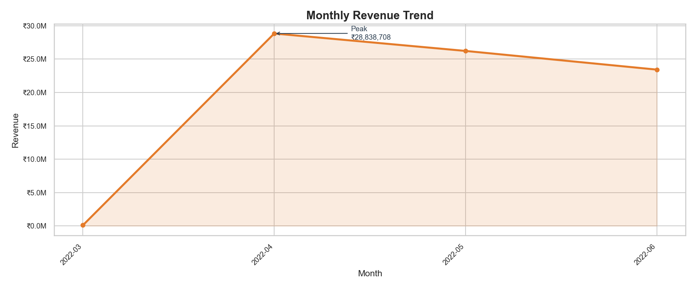
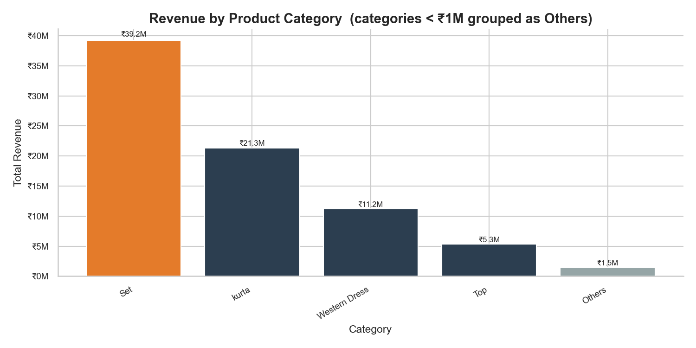
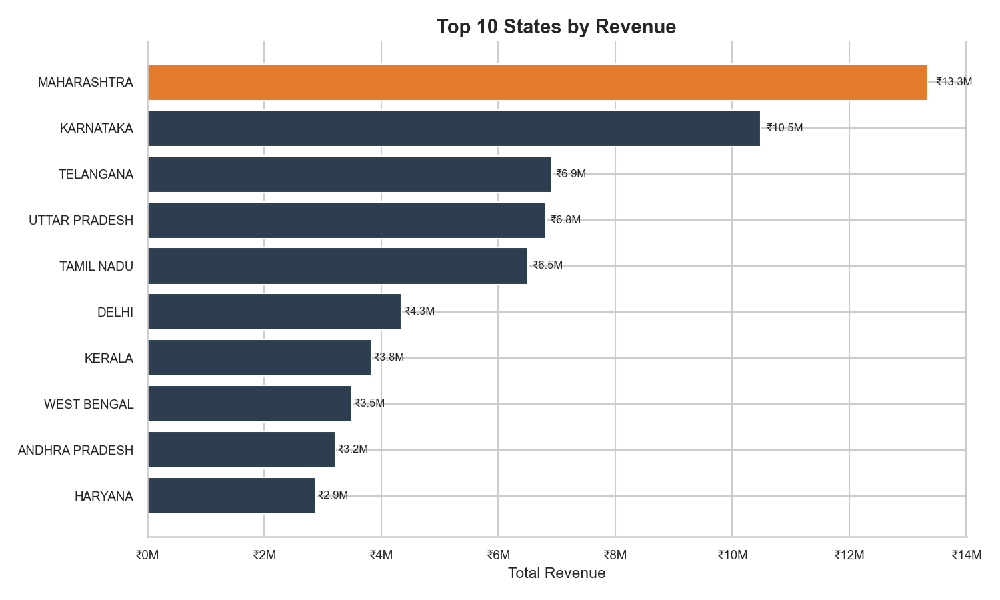
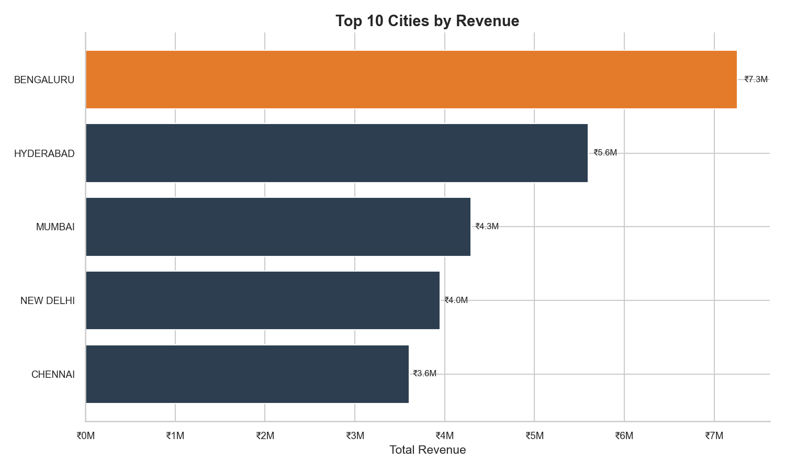
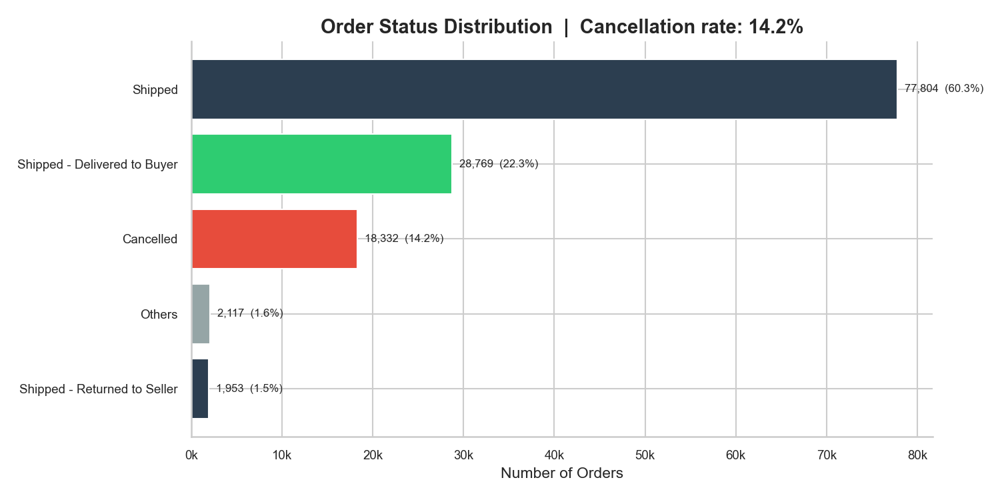

# Amazon Sales Data Analysis

## Project Overview
This project analyzes Amazon sales data to identify revenue trends, regional performance, and order status distribution.

## Tools Used
- Python
- Pandas
- Matplotlib
- Jupyter Notebook

## Dataset
The dataset contains Amazon order records including product category, sales revenue, shipping location, and order status.
Note: Original dataset is ~68MB. For demonstration purposes, this repository uses a 5% random sample of the data.

## Key Questions
- Which product categories generate the most revenue?
- Which regions produce the highest sales?
- What are the monthly sales trends?
- What is the cancellation rate?

## Key Insights
- The majority of revenue comes from the **Set** category.
- **Maharashtra** generates the highest revenue among states.
- Sales peaked in **Aprfil 2022**.
- A noticeable percentage (14.2%) of orders were cancelled.
- Orders are most frequently placed on **Sundays**, although daily variation is relatively low (±16%).

### 📈 Visualizations & Insights

#### Monthly Revenue Trend

*Revenue peaked in April 2022, while the low figures in March are due to incomplete data.*

#### Revenue by Product Category

*The 'Set' category accounts for nearly 50% of total revenue, identifying it as the primary driver of business growth.*

#### Top 10 States by Revenue

*Maharashtra emerges as the leading market by total revenue, followed closely by Karnataka.*

#### Top 5 Cities by Revenue

*Bengaluru is the highest-performing city, suggesting strong purchasing power in India’s major tech hubs.*

#### Order Status Distribution

*A significant cancellation rate of 14.2% represents a key business challenge that requires further investigation.*
